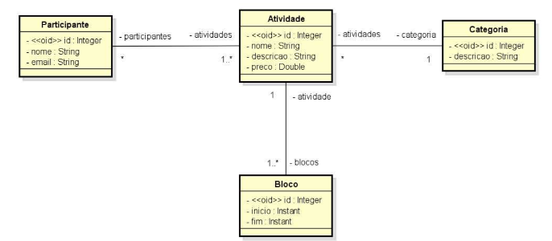
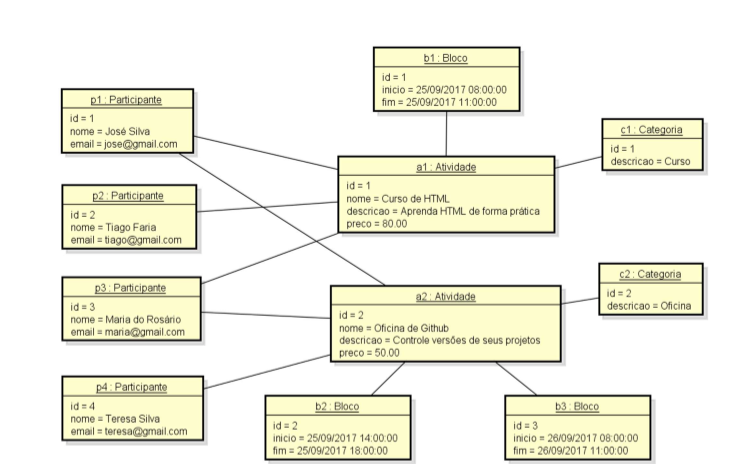

# Desafio: Modelo de domínio e ORM

## Objetivo

Você deve criar um projeto no Spring Boot com Java e banco de dados H2, e implementar o modelo  
conceitual conforme especificação a seguir. Além disso, você deve fazer o seeding da base de dados  
conforme diagrama de objetos que segue.

## ESPECIFICAÇÃO - Sistema EVENTO:

Deseja-se construir um sistema para gerenciar as informações dos participantes das atividades de um  
evento acadêmico. As atividades deste evento podem ser, por exemplo, palestras, cursos, oficinas  
práticas, etc. Cada atividade que ocorre possui nome, descrição, preço, e pode ser dividida em vários  
blocos de horários (por exemplo: um curso de HTML pode ocorrer em dois blocos, sendo necessário  
armazenar o dia e os horários de início de fim do bloco daquele dia). Para cada participante, deseja-se  
cadastrar seu nome e email.

**Instância dos dados para seeding:**

